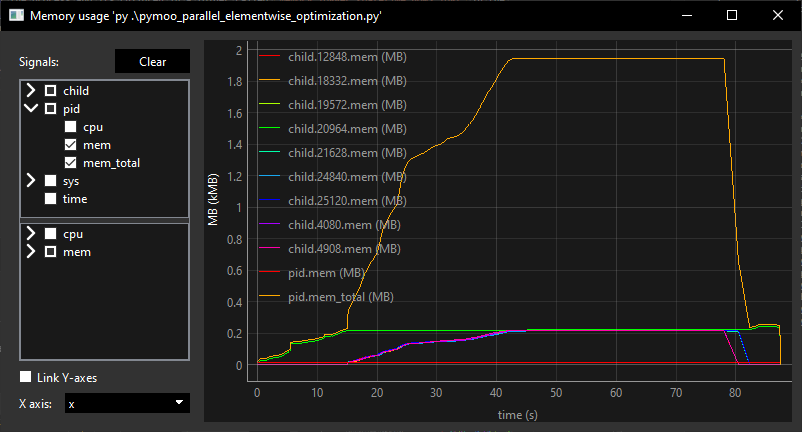
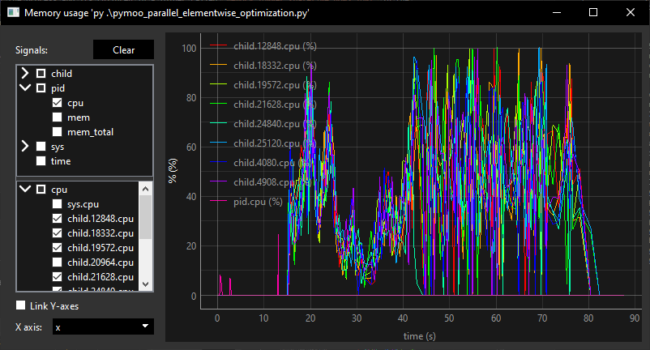

# Memory logger

A simple tool to log the cpu and memory usage of a process and its children over its execution. Can be used to monitor the memory usage of multiprocessing scripts.

<p align="center">
  
  
</p>

## Usage

```bash
python3 -m memory_logger <your command>
python3 -m memory_logger python3 my_multiprocessing_memory_heavy_script.py
```

The tool will log the memory and cpu usage of the process and its children in a folder called `memory_logger_{datetime_now}.log/` in the current directory. At the end of the process, the tool will plot the memory and cpu usage of the process and its children. It is however possible to plot the data at any time by running the following command:

```bash
python3 -m memory_logger.plot memory_logger_{datetime_now}.log/
```

### Configuration

The tool can be configured using the command.

```bash
python3 -m memory_logger.config --help
```

Analog to `git config`, it is possible to set parameters on a local or global scope. The configurable parameters can be displayed using `--help`.

## Installation

To install the package, you can use pip:

From a local copy of the repository:

```bash
pip install -e .
```

From the repository:

```bash
pip install git+https://github.com/PYBrulin/memory_logger.git
```

### Dependencies

The package requires the following dependencies (which are automatically installed with pip):

- `pandas` : To incrementally store the data
- `psutil` : To get the memory and cpu usage of the process and its children
- [`signal_plotter`](https://github.com/PYBrulin/signal_plotter) : To plot the data at the end of the process
